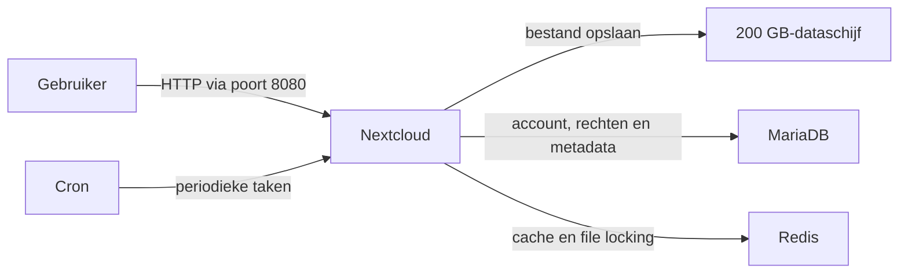
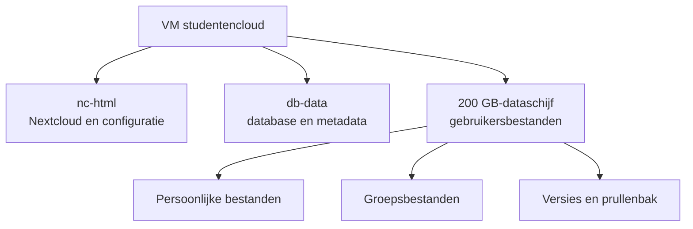

# Architectuur

Dit document toont eenvoudig hoe de Studentencloud is opgebouwd. Het bevat het
verplichte dataflowdiagram en storagediagram.

## Is dit werkelijk de huidige situatie?

Gedeeltelijk. De Docker-configuratie in de repository bevat werkelijk vier
containers: Nextcloud, MariaDB, Redis en cron. Daarin staat ook dat alleen
Nextcloud poort 8080 publiceert en dat gebruikersbestanden naar
`/srv/nextcloud-data/data` worden geschreven.

De installatiedocumentatie vermeldt VM `studentencloud`, IP-adres
`10.20.254.141`, Ubuntu Server 24.04 en een dataschijf van 200 GB. In de
repository staat nog geen uitvoer van `docker compose ps`, `findmnt` of een
testresultaat waarmee dit onafhankelijk is bewezen. Deze gegevens moeten dus op
de VM worden gecontroleerd.

TLS, reverse proxy, ClamAV, monitoring en back-up staan nog in de planning en
zijn daarom niet als werkende onderdelen in de diagrammen getekend.

## De onderdelen in gewone taal

| Onderdeel | Eenvoudige uitleg |
|---|---|
| Nextcloud | De website waar gebruikers inloggen en bestanden beheren. |
| MariaDB | Bewaart accounts, instellingen, rechten en informatie over bestanden. |
| Redis | Helpt Nextcloud sneller en voorkomt dat twee processen tegelijk hetzelfde bestand aanpassen. |
| Cron | Voert automatisch periodieke Nextcloud-taken uit. |
| 200 GB-dataschijf | Bewaart de inhoud van gebruikers- en groepsbestanden. |
| `nc-html` | Bewaart de Nextcloud-installatie en configuratie. |
| `db-data` | Bewaart de MariaDB-database. |

## Dataflowdiagram

Dit diagram toont wat er gebeurt wanneer een gebruiker een bestand uploadt.



In stappen:

1. De gebruiker opent Nextcloud via `http://10.20.254.141:8080`.
2. Nextcloud controleert het account en de rechten via MariaDB.
3. De inhoud van een upload gaat naar de 200 GB-dataschijf.
4. MariaDB bewaart wie de eigenaar is en waar het bestand bij hoort.
5. Redis ondersteunt cache en vergrendeling; cron voert achtergrondtaken uit.

## Storagediagram



De persoonlijke quota van 2 GB en groepsquota van 5 GB zijn logische limieten
in Nextcloud. Het zijn geen aparte schijfpartities. Alle bestanden staan samen
op de 200 GB-dataschijf, maar Nextcloud houdt per gebruiker en groep bij hoeveel
ruimte gebruikt mag worden.

## Wat komt er later nog bij?

Voor de definitieve omgeving moeten nog worden toegevoegd en getest:

- een reverse proxy met HTTPS/TLS vóór Nextcloud;
- ClamAV voor controle van uploads;
- monitoring van bereikbaarheid, opslag, database, certificaat en back-up;
- een afzonderlijk back-updoel voor bestanden, database en configuratie.

Wanneer deze onderdelen echt zijn geïnstalleerd, moeten de diagrammen worden
bijgewerkt.

## Hoe controleer je of het diagram klopt?

Voer op de VM uit:

```bash
cd infrastructure/docker
docker compose ps
docker compose exec app php occ status
findmnt /srv/nextcloud-data
df -h /srv/nextcloud-data
docker compose port db 3306
docker compose port redis 6379
```

Het diagram is bevestigd wanneer:

- `nc-app`, `nc-db`, `nc-redis` en `nc-cron` draaien;
- Nextcloud versie 35 rapporteert;
- `/srv/nextcloud-data` werkelijk op de 200 GB-schijf is gemount;
- MariaDB en Redis geen gepubliceerde hostpoort tonen;
- een geüpload testbestand na `docker compose restart` nog aanwezig is.

Bewaar de uitvoer en screenshots in `evidence/test-results/` en
`evidence/screenshots/`.
