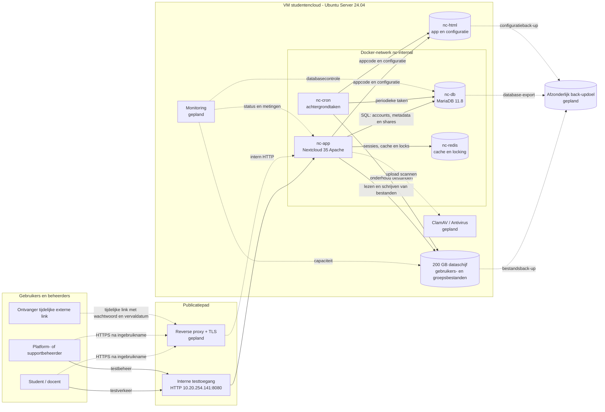
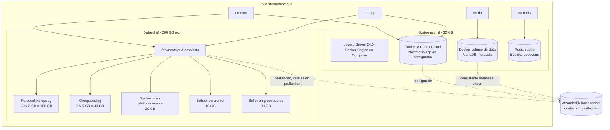

# Architectuur

Dit document bevat het verplichte dataflow- en storagediagram voor de
Studentencloud. De diagrammen zijn gebaseerd op de huidige Docker
Compose-configuratie en [netwerk- en opslagdocumentatie](../infrastructure/network-storage.md).

## Status en scope

De interne Nextcloud-stack en de 200 GB-dataschijf zijn vastgelegd. Tijdens de
testfase is Nextcloud intern bereikbaar via `http://10.20.254.141:8080`. De
definitieve reverse proxy met TLS, malwarecontrole, monitoring en het externe
back-updoel moeten nog worden geïmplementeerd en getest. In de diagrammen zijn
die onderdelen daarom gemarkeerd als **gepland**.

## Componenten

| Component | Functie | Netwerktoegang | Opslag |
|---|---|---|---|
| Client | Browser of toegestane synchronisatieclient van student, docent of beheerder | Via tijdelijke testpoort; later via HTTPS | Lokale synchronisatiecache op het clientapparaat |
| Reverse proxy | Geplande publieke ingang, TLS-beëindiging en doorsturen naar Nextcloud | Alleen HTTP/HTTPS volgens het goedgekeurde publicatiepad | Certificaten en proxyconfiguratie |
| `nc-app` | Nextcloud-webapplicatie, authenticatie, delen, quota en bestandsbeheer | Hostpoort `8080` tijdens test; intern netwerk `nc-internal` | `nc-html` en de gemounte datamap |
| `nc-cron` | Periodieke Nextcloud-achtergrondtaken | Alleen `nc-internal` | Deelt `nc-html` en de datamap met `nc-app` |
| `nc-db` | MariaDB met accounts, bestandsmetadata, shares en applicatie-instellingen | Alleen `nc-internal`, poort 3306 niet gepubliceerd | Docker-volume `db-data` |
| `nc-redis` | Cache en bestandsvergrendeling | Alleen `nc-internal`, poort 6379 niet gepubliceerd | Tijdelijke cache; geen primaire opslag |
| Dataschijf | Persoonlijke bestanden, groepsbestanden, versies en prullenbakdata | Alleen via de app- en croncontainers | `/srv/nextcloud-data/data` op de 200 GB-schijf |
| Malwarecontrole | Geplande controle van uploads met ClamAV/Nextcloud Antivirus | Alleen intern | Signatures, scanlog en eventueel tijdelijke scanruimte |
| Monitoring | Geplande controle van bereikbaarheid, fouten, database, opslag, certificaat en back-up | Beperkt tot beheerders | Meetgegevens en meldingshistoriek |
| Back-updoel | Geplande beveiligde kopie van bestanden, database en configuratie | Alleen voor bevoegde beheerders/back-upjob | Externe of afzonderlijke opslag; definitieve locatie nog vastleggen |

## Dataflowdiagram

In dit diagram betekenen doorgetrokken pijlen de huidige gegevensstromen.
Gestippelde pijlen zijn nog geplande stromen.

### Belangrijkste gegevensstromen

1. Een gebruiker meldt zich aan en verstuurt een aanvraag naar Nextcloud. In
   de testfase loopt dit rechtstreeks via poort 8080; de doelsituatie gebruikt
   HTTPS via de reverse proxy.
2. Nextcloud controleert de account- en deelmetadata in MariaDB en gebruikt
   Redis voor cache en bestandsvergrendeling.
3. Bestandsinhoud wordt op de 200 GB-dataschijf opgeslagen. MariaDB bewaart de
   bijbehorende metadata, eigenaar, shares en rechten.
4. `nc-cron` voert periodieke taken uit met dezelfde configuratie en datamap.
5. In de doelsituatie wordt een upload gecontroleerd door de malwarecontrole.
   Geweigerde bestanden worden niet als gebruikersbestand opgeslagen.
6. De back-upjob kopieert bestanden, een consistente database-export en de
   configuratie naar een afzonderlijk doel. De restoretest gebeurt naar een
   geïsoleerde testlocatie.

## Storagediagram

De quota in het diagram zijn planningswaarden en geen fysieke partities. Alle
gebruikersdata deelt hetzelfde bestandssysteem. Nextcloud handhaaft de quota
logisch per gebruiker en groepsmap. De reserves voorkomen dat de volledige
dataschijf vooraf aan gebruikers wordt toegewezen.

## Beveiligings- en vertrouwensgrenzen

- MariaDB en Redis publiceren geen hostpoorten en zijn alleen bereikbaar via
  `nc-internal`.
- De tijdelijke poort 8080 hoort alleen op het interne testnetwerk bereikbaar
  te zijn. Dit moet met een poortscan worden bewezen.
- De reverse proxy wordt de enige ingang voor normaal gebruikersverkeer zodra
  TLS actief is.
- Wachtwoorden, MFA-geheimen en encryptiesleutels worden niet in Git of in de
  diagrammen opgenomen.
- Een back-up bestaat uit gebruikersdata, metadata/database en configuratie.
  Synchronisatie, versiebeheer en prullenbak gelden niet als back-up.

## Nog te bevestigen na implementatie

- Definitieve hostname, reverse proxy en TLS-certificaat.
- Bereikbaarheid van poort 8080 na ingebruikname van de reverse proxy.
- Definitieve ClamAV-verbinding en plaats van scanlogs.
- Monitoringtool, meetpunten, drempels en meldingskanaal.
- Back-uptool, back-updoel, retentie en versleutelingsmethode.
- Werkelijk Docker-data-root voor de named volumes `nc-html` en `db-data`.
- Resultaten van netwerk-, opslag-, malware- en restoretests in `evidence/`.
